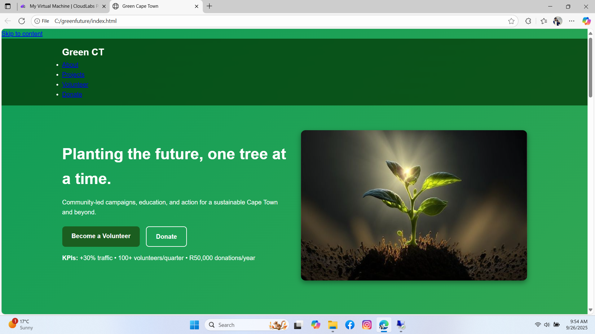
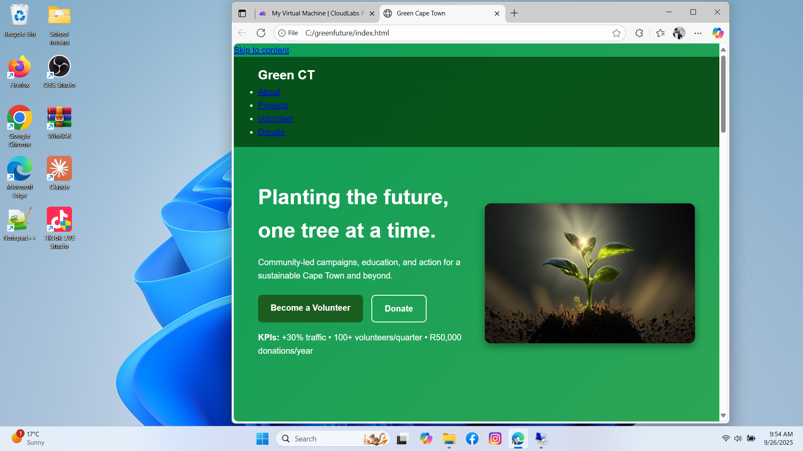
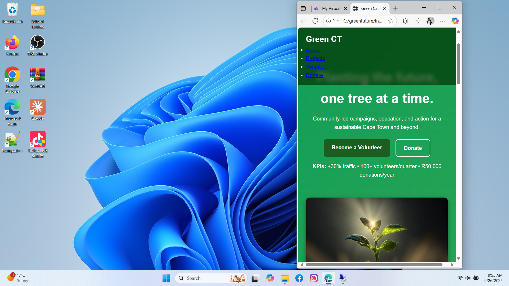

# Green Cape Town 

A student-led initiative website to promote sustainability, tree planting, and eco-awareness in Cape Town.

## Setup Instructions
1. Clone this repository or download the ZIP.
2. Open `index.html` in your browser.
3. Make sure `styles.css` and `images/` are in the same folder.

## Changelog
- **Part 2 Updates**
  - Linked an external CSS file.
  - Added semantic HTML (`section`, `article`, `header`, `footer`).
  - Improved accessibility (`aria-live`, skip link, alt text).
  - Applied responsive design with flexbox/grid and media queries.
  - Added hover states for navigation and buttons.
  - Created consistent typography and green gradient background.
- **Feedback from Part 1**
  - Fixed invalid inline styles.
  - Made all images responsive (removed hardcoded widths).
  - Added descriptive alt text to all images.

## Responsive Design Evidence

The website has been tested on multiple devices using Chrome Developer Tools.

### Screenshots
- **Desktop (1920px)**  
  

- **Tablet (820px)**  
  

- **Mobile (375px)**  
  

### Developer Tools Usage
- Used Microsoft Edge DevTools to test breakpoints at 1920px, 820px, and 375px.  
- Adjusted font sizes, layout, and button widths for better readability.  
- Verified hover/focus states and responsive images (`srcset`) at different resolutions.

## References
- [MDN Web Docs](https://developer.mozilla.org/)
- [W3Schools CSS Grid Guide](https://www.w3schools.com/css/css_grid.asp)
- [Google Fonts](https://fonts.google.com/)
- Images sourced from [Pinterest](https://www.pinterest.com/)
